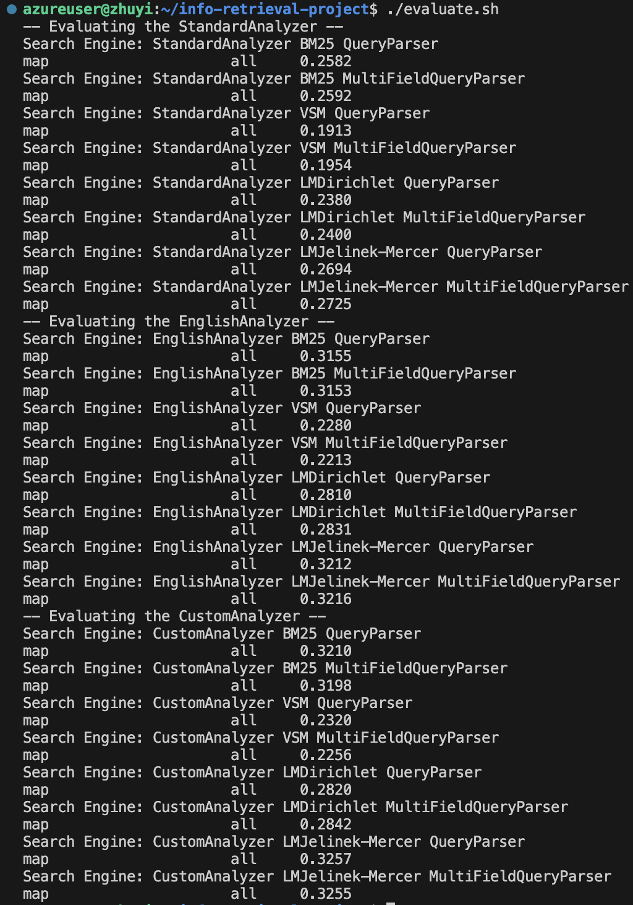

# Info Retrieval Project

This project uses Java 1.8 and Apache Lucene 8.11.2 to index the collection in the `collection` folder which is around 2GB in size, search the generated index and score different search engines using the queries provided by Professor Yvette Graham.


Group Name: **Golden Retrievers**

|      Student Name      | Student ID |                      Course                      |
|:----------------------:|:----------:|:------------------------------------------------:|
|     Prathamesh Sai     |  19314123  |       Integrated Computer Science (M.C.S.)       |
| Sébastien Dunne Fulmer |  19333374  |     Integrated Computer Engineering (M.A.I.)     |
|      Eamon Phelan      |  02406390  |               Intelligent Systems                |
|  Aadesh Milind Rasal   |  22301280  |               Intelligent Systems                |
|       Yifan Zhu        |  18300717  |               Intelligent Systems                |


## Highest MAP value so far (with Phase 1 QRel file)
Highest MAP: **0.3257**

Search engine combination that gave this MAP: **CustomAnalyzer, LMJelinek-Mercer, QueryParser**




## Run

### Quickest way (just evaluate)
Just evaluate the code (indexing already done in `/index` if accessing from our virtual machine):

```
chmod +x evaluate.sh
./evaluate.sh
```

### Longer way (indexing the collection yourself)
Index the collection yourself first (if you aren't running on our virtual machine or want to check if indexing works):

```
chmod +x run.sh
./run.sh
```

Then evaluate the code afterwards:

```
chmod +x evaluate.sh
./evaluate.sh
```

### Longest way (run each operation individually)
If you want to run the code individually:

```
java -jar target/info-retrieval-project-1.0-SNAPSHOT.jar --operation <index|search|evaluate> <analyzer> (similarity) (parser)
```

where entities with <> are required and entities with () are optional depending on the operation you require, since `similarity` and `parser` are required for `evaluate` and `search` but not `index`. The only requirement for `index` is `analyzer`.

* `index` builds the Lucene index using the Indexer class
* `search` allows for interactive search using the Searcher class (brought over from our previous assignment, but not the purpose of this assignment since we use topics for queries now, so this option is only here for curiosity purposes)
* `evaluate` scores against a library of queries from the `topics` folder using the Scorer and Searcher classes. We use trec_eval thereafter to get MAP values from these.

## Setting up trec_eval
We added trec_eval as a git submodule in this codebase. It should be setup already on our virtual machine, so demonstrators don't have to do anything for this. However, if you are setting up this repository from scratch, do this:

```
git submodule update --init
cd trec_eval
make
make quicktest
cd ..
```

### Git issues with trec_eval
If you are setting up the git submodule for trec_eval for the first time, you may get a trec_eval.diff being tracked which won't go away. Simply make a .gitignore inside the trec_eval folder and put the wildcard '*' inside. This is already handled for our virtual machine so demonstrators don't need to follow this.
